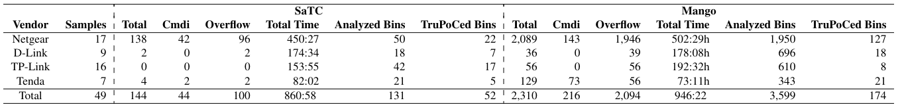
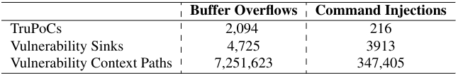
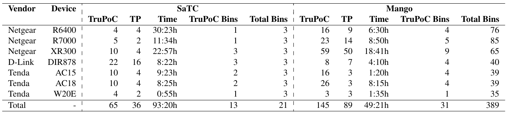
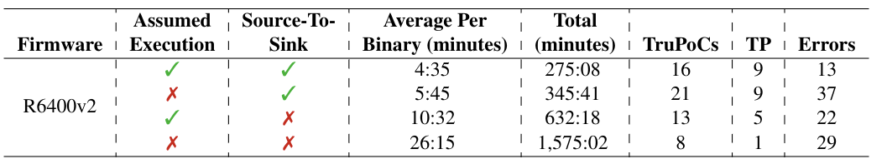
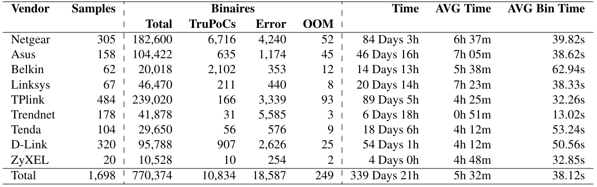
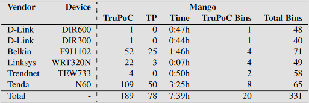

# Experiment Replication
If you would like to replicate any of the experiments found in the paper you can find the instructions below.  
Make sure to have docker setup as a non-root user on the machine.  
To initially setup the project follow these steps:  
> [!IMPORTANT]  
> Some binaries will error out and that's okay and normal.   
> Our tool isn't perfect and can't deal with all possible corner cases, but we try and give you as much data as we can.

> [!CAUTION]  
> Use the `--rda-timeout` flag to increase the timeout if you are running on an under-powered machine, this will increase total analysis time, but also increase the probability of not missing important values. The default timeout is 5 minutes per call-chain

#### Machine Info
In case you were wondering what the machine specs were used in the paper:  
Each mango container was run on a single-core 2.30GHz Intel Xeon CPU with at least 5GB of RAM.  
This was parallelized across 4000 cores using kubernetes.
> [!WARNING]  
> Some binaries will consume upwards of 20GB of RAM.


#### Install Docker (If you don't have it already)
```bash
curl -sSL https://get.docker.com/ | sudo sh
sudo usermod -aG docker $USER
sudo reboot
```
#### venv setup
```bash
sudo apt install python3.11 python3-pip
python3.11 -m pip install virtualenv
python3.11 -m virtualenv venv
```

#### operation mango installation
```bash
git clone https://github.com/sefcom/operation-mango-public.git
source venv/bin/activate
cd operation-mango-public
pip install -e .
pip install -e pipeline/
mango-pipeline --build-docker
```

### Table 1 - Karonte Dataset Evaluation

[karonte_dataset.tgz](https://github.com/ucsb-seclab/karonte) - sha256 25b8204d2fbac800994fefb30c8dbf80af3f15e57a9c04397f967f12a879b501   
In order to reproduce the mango results run the below commands (where the 20 represents the amount of docker containers your setup can handle):
```bash
mango-pipeline --path path/to/karonte-dataset --results your/karonte-results/dir --env --parallel 20 # Runs environment/nvram value resolution

#The two commands below can be done in parallel

mango-pipeline --path path/to/karonte-dataset --results your/karonte-results/dir --mango --parallel 20 # Runs mango analysis for command injections
mango-pipeline --path path/to/karonte-dataset --results your/karonte-results/dir --mango --parallel 20 --category overflow # Runs mango analysis for buffer overflows
```

To view the runtime results for these values run:
```bash
python operation-mango-public/pipeline/mango_pipeline/scripts/show_table.py your/karonte-results/dir
```

### Table 2 - Path Context Aggregation


Once you've run the above analysis from [Table 1](#table-1---karonte-dataset-evaluation), you can run the path aggregation script.
```bash
python operation-mango-public/pipeline/mango_pipeline/scripts/path_context_aggregator.py your/karonte-results/dir
```
This will print out the json aggregation of all paths towards the sink keyword as well as in the file `count.agg`.  
`strcpy` is the only sink in the buffer overflow category, every other sink falls into Command Injections so sum those together.

### Table 3 - SaTC 7 Handpicked Firmware

7_firmware.tar.gz - (E-mail authors with academic e-mail (wfgibbs@asu.edu)) - sha256 55859e73c9d8b46152e899b7ad0110fe671d82d462b44cc166b4c8e00fb76ab6  
In order to reproduce the mango results run the below commands (where the 20 represents the amount of docker containers your setup can handle):
```bash
mango-pipeline --path 7_firmware --results your/7-firmware-results/dir --env --parallel 20 # Runs environment/nvram value resolution

#The two commands below can be done in parallel
mango-pipeline --path 7_firmware --results your/7-firmware-results/dir --mango --parallel 20 # Runs mango analysis for command injections
mango-pipeline --path 7_firmware --results your/7-firmware-results/dir --mango --parallel 20 --category overflow # Runs mango analysis for buffer overflows
```

To view the runtime results for these values run:
```bash
python operation-mango-public/pipeline/mango_pipeline/scripts/show_table.py your/7-firmware-result/dir --show-firmware
```

### Table 4 - Manual Analysis of TruPoCs


This table is a manual analysis of a subset of TruPoCs Generated from [Table 1](#table-1---karonte-dataset-evaluation).  
For the purpose of the paper, TruPoCs are any analysis results with a score of 7 or higher.
These can be found with a simple find command:
```bash
find your/karonte-results/dir -type f -iname '[7-9]*' 
```
Once found, it is up to your reverse engineering skills to verify the validity of the reports.


### Table 5 - Ablation of Mango Analysis on R6400v2


ablation-firmware.tar.gz - (E-mail authors with academic e-mail (wfgibbs@asu.edu)) - sha256 a3c0acd2b588978cdb2d1873929e9904a84cdba1f9dd603b41e0a109fecba8e6   
This is an ablation study of the two algorithmic contributions that Operation Mango introduces.

To replicate this, run the following commands:
> [!WARNING]  
> You must have the exact folder/result_folder names for the final script to function
```bash
mkdir ablation
cd ablation
mango-pipeline --path path/to/ablation-firmware \
               --results ablation-default \
               --parallel 40 \
               --env # Do an env pass

# Copy env results to other ablation dirs
cp -r ablation-default ablation-assumed # Dir for no assumed execution
cp -r ablation-default ablation-trace # Dir for no sink-to-source analysis
cp -r ablation-default ablation-all # Dir for neither

# The following 4 mango-pipeline commands can be run in parallel

# Current version of mango with both assumed nonimpact and sink-to-source
mango-pipeline --path path/to/ablation-firmware \
               --results ablation-default \
               --parallel 10 \
               --mango 

# mango without assumed nonimpact
mango-pipeline --path path/to/ablation-firmware \
               --results ablation-assumed \
               --parallel 10 \
               --mango \
               --extra-args full-execution

# mango without sink-to-source
mango-pipeline --path path/to/ablation-firmware \
               --results ablation-trace \
               --parallel 10 \
               --mango \
               --extra-args forward-trace

# mango without assumed nonimpact or sink-to-source
mango-pipeline --path path/to/ablation-firmware \
               --results ablation-all \
               --parallel 10 \
               --mango \
               --extra-args full-execution forward-trace
```

Once all analyses have finished running, you can print the results using the following command:
```bash
python operation-mango-public/pipeline/mango_pipeline/scripts/ablation.py ablation/
```
This will create a nice table with well-formatted results.


### Table 6 - Large Scale Evaluation


> [!CAUTION]  
> This dataset is 20GB zipped!!!  
> The results can take up to 400GB!!!

large_dataset.tar.gz - (E-mail authors with academic e-mail (wfgibbs@asu.edu)) - sha256 a3d8012ba7bcaa1f0f34b7ce6783b5d6441902644f9bedae4031b71ab3490e2e   

Beware all ye who enter...  
Unless you have access to an immense amount of compute power, this table will take you a while to reproduce.

Once you download the entire dataset, extract all of the firmware.
```bash
tar -xvzf large_dataset.tar.gz
cd large_dataset
find . -type f -exec tar -xvzf {} \;
cd ..
```
Once all the firmware is extracted, you can run the experiments:
```bash
mango-pipeline --path large_dataset  --results your/large_dataset/res_dir --env --parallel 20 # Runs environment/nvram value resolution

#The two commands below can be done in parallel
mango-pipeline --path large_dataset --results your/large_dataset/res_dir --mango --parallel 20 # Runs mango analysis for command injections
mango-pipeline --path large_dataset --results your/large_dataset/res_dir --mango --parallel 20 --category overflow # Runs mango analysis for buffer overflows
```
To get a similar table output to table 6, run:
```bash
python operation-mango-public/pipeline/mango_pipeline/scripts/show_table.py your/large_dataset/res_dir
```


### Table 7 - Additional Experiment (Appendix)


additional_experiment.tar.gz - (E-mail authors with academic e-mail (wfgibbs@asu.edu)) - sha256 0374b6efade719cf744eeeacd9729df7908dfca1936d7c136cb0c18446bb8300

This is just an additional experiment showing the extensability of the project, similar to [Table 1](#table-1---karonte-dataset-evaluation) and [Table 3](#table-3---satc-7-handpicked-firmware).

```bash
mango-pipeline --path path/to/additional-dataset --results your/additional-results/dir --env --parallel 20 # Runs environment/nvram value resolution

#The two commands below can be done in parallel

mango-pipeline --path path/to/additional-dataset --results your/additional-results/dir --mango --parallel 20 # Runs mango analysis for command injections
mango-pipeline --path path/to/additional-dataset --results your/additional-results/dir --mango --parallel 20 --category overflow # Runs mango analysis for buffer overflows
```

To get a similar table output to table 7, run:
```bash
python operation-mango-public/pipeline/mango_pipeline/scripts/show_table.py your/large_dataset/res_dir --show-firmware
```